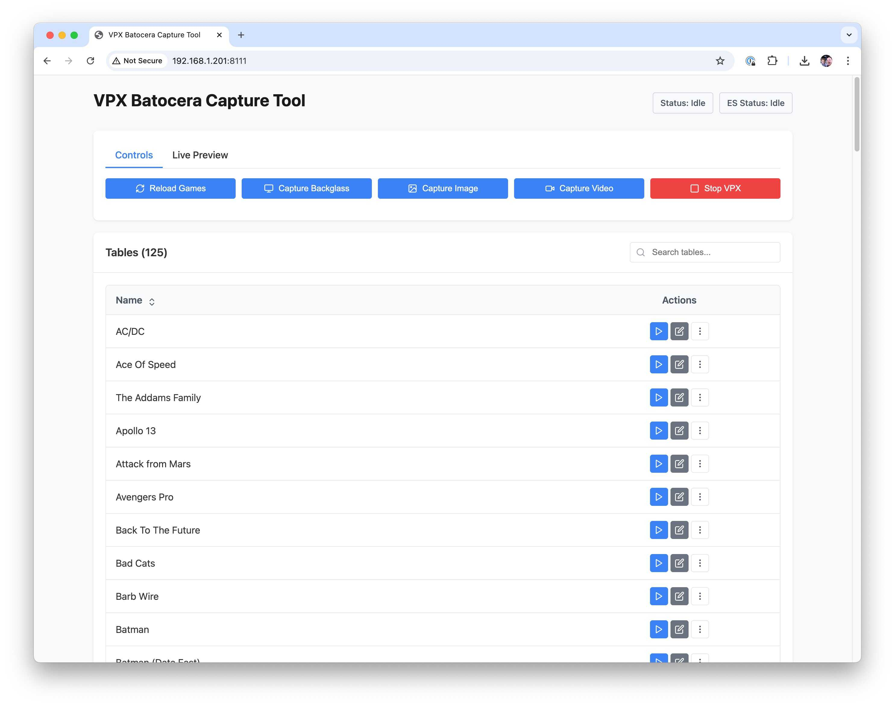
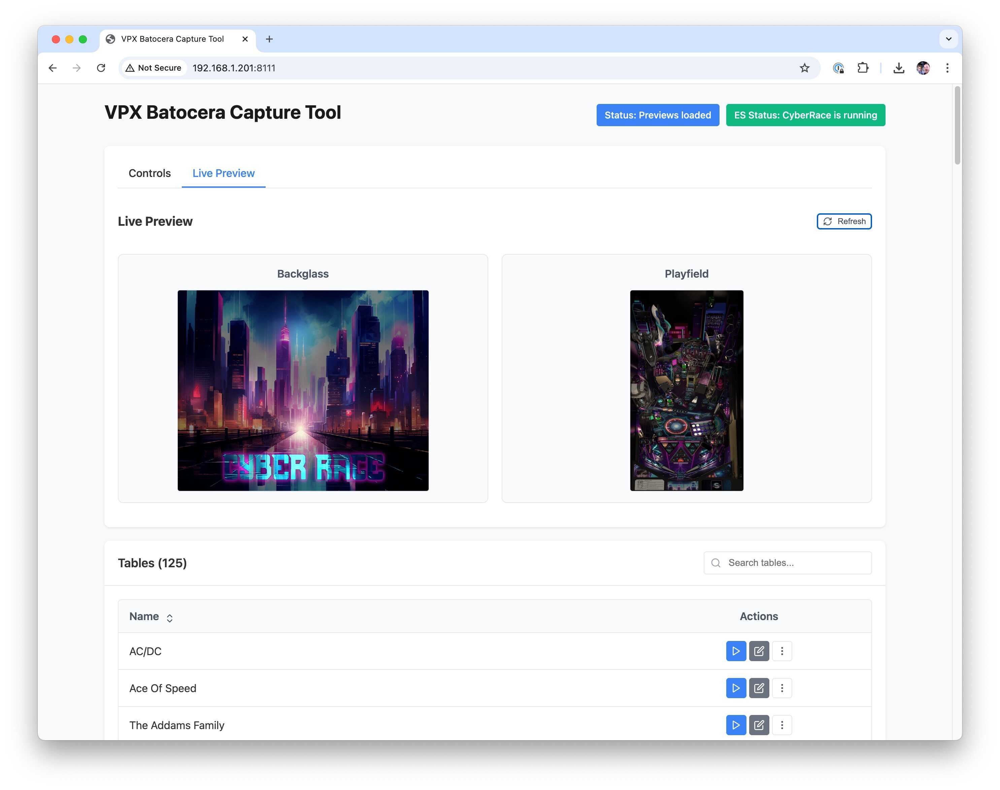
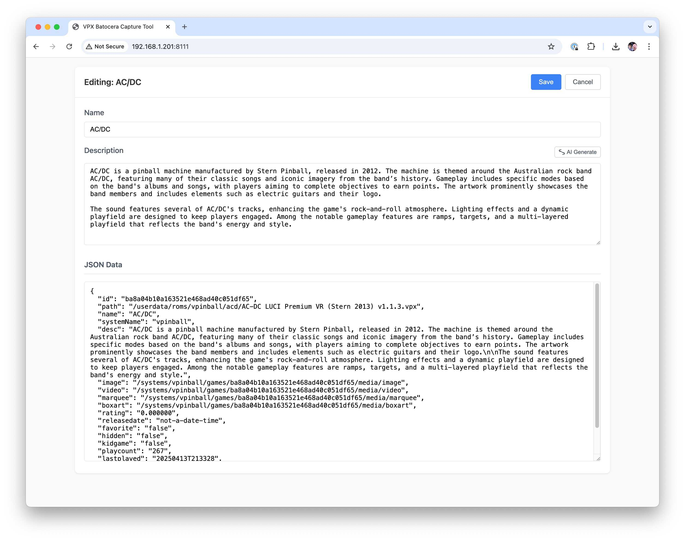

# VPX Batocera Capture Tool

A utility for capturing backglass and playfield images and videos from your Visual Pinball X (VPX) Standalone cabinet running Batocera 42.

## Features

- Preview and capture the current playfield and backglass in real time
- Edit game metadata (name, description, etc.)
- Update JSON metadata for each table
- Generate descriptions using OpenAI (optional)

## Screenshots

  
*Reload games, capture media, or launch tables directly*

  
*See what's on your cabinet if you are away from it*

  
*Edit table names, descriptions, and metadata inline with JSON view*


## Settings

```ini
[Settings]
ESURL=http://your-es-ip:port
OpenAIKey=sk-XXXXXXXXXXXXXXXXXXXXXX
```

- `ESURL`: URL to your EmulationStation frontend *(leave blank)*
- `OpenAIKey`: Optional. Enables AI-powered table description generation *(experimental)*

## Installation

### 1. Download and Set Up the Tool

1. Go to the [Releases page](https://github.com/jsm174/vpxbct/releases) of the project.  
2. Download the latest release.  
3. Rename the extracted folder to:  
   `vpxbct-linux-x64`  
   *(This name is required to match script expectations.)*  
4. Copy the folder to your Batocera box at:  
   `/userdata/system/configs/vpinball`

### 2. Install the VPXBCT Service Script

1. Inside the downloaded project, locate the `services-script` folder.  
2. Copy the `VPXBCT` script from that folder to:  
   `/userdata/system/services/` on your Batocera system.  
3. Open a terminal (either via SSH or Batocera’s local terminal) and run:  
   ```bash
   chmod +x /userdata/system/services/VPXBCT
   
### 3. Enable the Service in Batocera

1. On your Batocera system, go to:  
   **Main Menu > System Settings > Services**  
2. Look for the **VPXBCT** toggle and enable it.

   - If it’s not visible, you may need to restart Batocera.  
   - Alternatively, enable it via terminal with:  
     ```bash
     batocera-services enable VPXBCT
     ```

### 4. Enable Public Web API Access

1. On your cabinet, go to:  
   **EmulationStation > Developer > Frontend Developer Options**  
2. Enable **Public Web API Access**


## Shoutouts

Thanks to the entire Batocera team, especially @susan34, @dmanlfc, and @maximumentropy!
